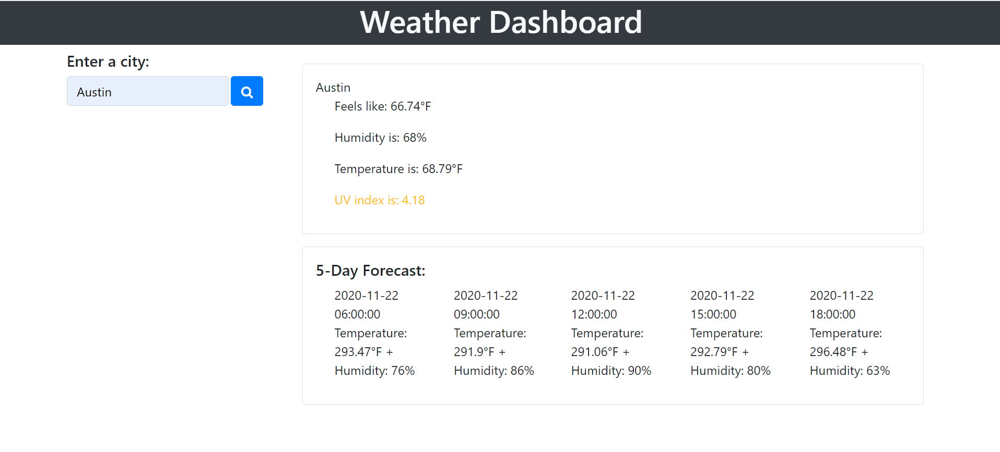

# Weather-App
This is a weather app that displays the temperature, humidity, UV index, and what temperature it feels like. Type in any city in the world to retrieve weather information for the current day as well as the next five days.

# Languages Used
CSS
HTML
Javascript

# Link
https://github.com/kccho2254/Weather-App

# Credits

## [Bootstrap](https://getbootstrap.com/docs)

Used Bootstrap CSS library

## [w3schools](https://www.w3schools.com/html/html_forms.asp)

The structure for the contact form came from this website

## [TeamTreeHouse](https://teamtreehouse.com/community/imageattrsrcimagelocation)
Helpful for figuring out jQuery image.attr()

## [Mozilla Developer](https://developer.mozilla.org/en-US/)

Is really helpful for understanding flex

## [README Guide](https://github.com/adam-p/markdown-here/wiki/Markdown-Cheatsheet#lines)

Helpful website for learning Markdown syntax

# Contributing
Feel free to reach out or request pulls from github. My classmates and class instructor Calvin are also to thank for helping me learn.

## License
© Kevin C Cho

Licensed under MIT License